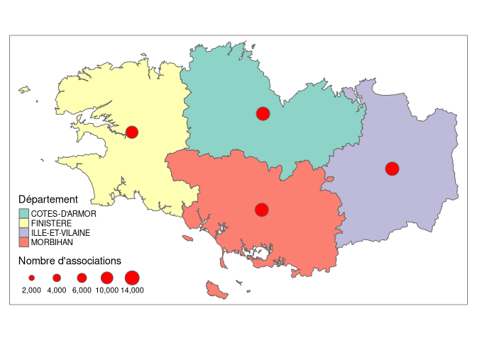

RNA - Une étude des associations françaises sur la base d’un document
administratif
================

-   [1 Introduction](#intro)
-   [2 Découvrir les données](#decouvrir)
    -   [2.1 Aller chercher les données sur le site
        Data.gouv.fr](#aller-chercher-les-données-sur-le-site-data.gouv.fr)
-   [3 Elles sont où les assos ? ou Répresentations
    géographiques](#geographie)
    -   [3.1 Crééer la variable de
        département](#crééer-la-variable-de-département)
    -   [3.2 Cartes de l’IGN](#cartes-de-lign)
    -   [3.3 Joindre les données géographiques et
        d’associations](#joindre-les-données-géographiques-et-dassociations)

# 1 Introduction

Pourquoi ce document a-t-il un nom si mystérieux ? Et à qui
s’adresse-t-il ?

L’idée derrière ce projet est de se concentrer à la fois sur l’usage
d’un language de programmation (R) et sur ses utilisations possibles,
ici l’étude des associations loi 1901 françaises. Les publics visés sont
multiples puisqu’on essaiera de faire en sorte qu’aucun pré-requis ne
soit nécessaire pour comprendre le cheminement.

Je vais tenter tout expliciter, comme si j’apprenais en écrivant (ce qui
est parfois vrai). Des élèves de Seconde ne pourront peut-être pas tout
comprendre, et des étudiant·es de Master 2 trouveront peut-être cela
trop lent. Un goût de trop peu même ! Mais l’idée est d’attiser la
curiosité et de *faire faire* !

PS : si des personnes souhaitent contribuer au projet, c’est avez grand
plaisir. Rien n’est encore fixé (font et forme) et c’est d’autant plus
intéressant de travailler collectivement !

# 2 Découvrir les données

Une question est apparue spontanément. Qui sont les associations
françaises ? Répondre à cette question en amène directement d’autres. Où
sont-elles? Combien sont-elles ? Quand ont-elles été créées ? Quel est
leur objet ? Pour cela, on a récupérer le fichier du Répertoire National
des Associations sur le site <https://data.gouv.fr>. Ce site est une
tentative de rendre ouverte les données publiques françaises et de
nombreux acteurs publient leurs jeux de données : collectivités
territoriales, ministères, etc. Cela va d’un fichier de données sur les
associations, aux dotations perçues par les communes au nombre de
médecins par département et par spécialité. Il en existe d’autres comme
le site de l’INSEE. Celui-ci provient tout de même d’une volonté
explicite de publiciser les données produites par l’Etat.

## 2.1 Aller chercher les données sur le site Data.gouv.fr

### 2.1.1 Comprendre le site

Il suffit donc d’écrire “rna associations” dans la barre de recherche.
Le premier résultat s’intitule “Répertoire National des Associations” et
est produit par un “organisme certifié”, ici le Ministère de
l’Intérieur. On peut y lire :

> RNA répertorie l’ensemble des associations relevant de la loi du 1er
> juillet 1901 relative au contrat d’association, dont le siège est en
> France (métropole et outre-mer) à l’exclusion des départements de la
> Moselle (57), du Bas-Rhin (67) et du Haut-Rhin (68) qui relèvent d’un
> régime spécifique. Le RNA contient également, dans les mêmes
> conditions, les associations reconnues d’utilité publique. Le RNA est
> alimenté après instruction du dossier par le greffe des associations
> lors d’une création, d’une modification ou d’une dissolution.

> Les déclarations de création sont ensuite publiées au Journal Officiel
> des Associations et Fondations d’Entreprise (JOAFE).

Bon, qu’apprend-on ? Qu’on aurait toutes les données relatives aux
associations hors-concordat[1], notamment les associations reconnues
d’utilité publique, et que le fichier est mis à jour à chaque création,
dissolution ou modification d’une association. Que cela nous dit-il sur
les données ? Pas grand chose, non ? Qu’est-ce qu’on veut dire par là
“dire sur les données” ? Quel est le fichier de données ? A quoi il
ressemble ? Quel type d’information a-t-on dedans ? Manque-t-il des
données ?

Mais, magie, c’est bien foutu l’Etat Français, il est ensuite précisé
ceci : + le cas échéant, le n° RNA + le nom de l’association et son
sigle + l’objet de l’association et son objet social + l’adresse du
siège + le cas échéant, l’adresse de gestion + le cas échéant, le site
internet de l’association

On devrait donc avoir toutes ses informations. C’est super déjà si c’est
le cas ! On va pouvoir étudier la domiciliation des associations, leurs
noms et leurs objets. Si on descend sur la page internet, on peut y voir
un encart “Documentation” et un fichier “Description des données
exposées par le RNA”. Ce fichier est un tableau qui décrit exactement ce
qui est présent dans les données du RNA.

### 2.1.2 Découvrons les données

Ouvrons ce fichier. On peut d’abord y voir le nom exact du jeu de
données correspondant au tableau qui suit :.
Concrètement ça veut dire que le tableau qui suivra ce titre va
expliciter les données pour chaque fichier qui aura un nom sous la forme
“rna\_waldec” suivi de “YYYYMMDD”. “YYYYMMDD” correspondant à une date :
les quatre “Y” représentent l’année (*year* en anglais), par exemple
2020, “M” représente le mois et “D” le jour (*day* en anglais).

Et les variables ? 

Chaque variable est décrite par son nom dans la base de données (ici la
première variable prendra le nom “id”), son type (ici la première
variable est un varchar(10) ), et enfin sa description (ici la première
variable est le Numéro Waldec national unique de l’association). Pour ce
qui est du type de variable, on ne va pas tout couvrir, mais on peut
noter cependant que dans ce jeu de données on ne trouve que ceci : +
varchar(n), avec un “n” un nombre : c’est une chaîne de caractères
alphanumériques de longueur maximale *n*. Par exemple, “RNA” est une
chaîne de caractères de longueur 3 + date : une date, rien
d’impressionnant, mais qui doit avoir un format de date. Par exemple,
2020-01-01. + text : une chaîne de caractère dont la longueur n’est pas
définie.

Téléchargeons un des dossiers correspondant à “rna\_waldec”. Celui du 01
septembre 2020. Vous pouvez le trouver de manière stable ici :
<https://www.data.gouv.fr/fr/datasets/r/8c3384ab-bd29-43df-9730-8c89a88e634a>.
C’est un dossiez .zip ou dossier compressé dont on peut extraire
plusieurs fichiers. Dans vos documents, créez un dossier
“rna-associations”, puis dans ce dossier un dossier “Data” dans lequel
vous placez le fichier .zip. Vous pouvez maintenant faire un
clique-droit extraire.

De nombreux fichiers apparaissent. Ils ont tous un nom sous la forme
“rna\_waldec”, suivi de la date, puis de “dpt” et d’un numéro. On peut
pré-supposer assez facilement que ces deux derniers items sont le numéro
de département et que donc nos données sont subdivisées par département.
Un fichier correspond donc à un département. Mais que veut dire le
“.csv” à la fin de chaque nom de fichier ?

Un fichier .csv c’est tout simplement un fichier texte. Chaque ligne
correspond à une association et chaque variable est séparée par un
séparateur (souvent une virgule, ou un point-virgule ou une tabulation).
Vous pouvez ouvrir ce fichier dans Libre Office Calc ou Only Office
Desktop Editor(ou possiblement Microsoft Excel si vous préférez les
solutions payantes et non-libres). Pour l’ouvrir dans R, il nous suffit
de savoir quel est le séparateur, de connaître le nom du fichier et le
dossier dans lequel il est placé.

Ici, en ouvrant un des fichiers dans un éditeur de texte de type “Libre
Office Writer ou Microsoft Word ou”Kate“, on voit que chaque guillemet
est séparée d’une autre guillement par un point-vrigule, c’est notre
séparateur. Il nous suffit donc d’utiliser la fonction”read.csv2" qui
permet d’ouvrir un fichier .csv séparé par un point-virgule. Pour
vérifier, on demande de l’aide pour cette fonction.

``` r
?read.csv2
```

On voir dans “Usage” la fonction “read.csv2”. L’argument qui nous
intéresse est “sep” puisqu’est écrit que “sep” est le *field seprator
character* ou autrement dit ce qui sépare les variables. On voit que
pour read.csv2, sep est bien un “;”. On peut donc utiliser cette
fonction. On va ouvrir le fichier pour le Département du Finistère (29),
qu on va enregistrer dans notre session R comme l’objet intutlé
“asso29”.

``` r
asso29 <- read.csv2("data/associations/rna_import_20200901_dpt_29.csv")
dim(asso29)
```

    ## [1] 10553    24

On voudrait faire de même pour tout les départements bretons. On les
ouvre donc séparément, puis on les combine en un unique dataframe
*assoBZH* \[Voir plus loin pour une méthode permettant d’ouvrir tous les
dataframes d’un coup\].

``` r
asso56 <- read.csv2("data/associations/rna_import_20200901_dpt_56.csv")
asso35 <- read.csv2("data/associations/rna_import_20200901_dpt_35.csv")
asso22 <- read.csv2("data/associations/rna_import_20200901_dpt_22.csv")
assoBZH <- rbind(asso22, asso29, asso35, asso56)
rm(asso22, asso29, asso35, asso56)
```

On voit grâce à la fonction *dim* ci-dessus qu’ona “1” lignes (ou
associations) et 24 variables pour l’objet *asso29*. Affichons les 5
premières lignes et les 5 premières variables pour voir à quoi cela
ressemble.

``` r
head(assoBZH, n = 5)[,1:5]
```

    ##               id      id_ex siret gestion date_creat
    ## 1 221S0221000002 0221000002  <NA>    221S 0001-01-01
    ## 2 221S0221000015 0221000015  <NA>    221S 0001-01-01
    ## 3 221S0221000020 0221000020  <NA>    221S 0001-01-01
    ## 4 221S0221000029 0221000029  <NA>    221S 0001-01-01
    ## 5 221S0221000035 0221000035  <NA>    221S 0001-01-01

# 3 Elles sont où les assos ? ou Répresentations géographiques

On a vu dans les données que pour chaque association on a le code INSEE
sous la variable “adrs\_codeinsee”. Le code INSEE, c’est un peu comme le
code postal, autrement dit un identifiant unique pour chaque commune,
mais délivré par l’INSEE.

## 3.1 Crééer la variable de département

On aimerait représenter le nombre d’associations par département. Pour
l’instant, le code INSEE ne nous permet que d’identifier la commune.
Cependant, les deux premiers chiffres du code INSEE sont en fait le code
du département. Il nous suffit donc de subdiviser le code INSEE à chaque
ligne en ne gardant que les premiers chiffres. On créé une variable qui
s’intitutle “codeDept”.

``` r
assoBZH$codeDept <- substr(assoBZH$adrs_codeinsee, 1,2)
```

## 3.2 Cartes de l’IGN

Il va falloir maintenant récupérer les données nous permettant de
représenter la carte de France des départements, puis le nombre d’assos
par département. On ne va pas entrer dans les détails des données
géographiques ici.

On peut se procurer les fichiers ici :
<https://wxs.ign.fr/oikr5jryiph0iwhw36053ptm/telechargement/inspire/GEOFLA_THEME-DEPARTEMENTS_2016%24GEOFLA_2-2_DEPARTEMENT_SHP_LAMB>93\_FXX\_2016-06-28/file/GEOFLA\_2-2\_DEPARTEMENT\_SHP\_LAMB93\_FXX\_2016-06-28.7z&gt;

En extrayant le fichier on voit qu’il existe une multitude de fichiers
différents. \[Expliciter le chemin et l’extraction\].

require(sf)

``` r
library(sf) # Package nécessaire pour l'ouverture d'un fichier géographique "shp" 
```

    ## Linking to GEOS 3.8.1, GDAL 3.0.4, PROJ 6.3.2

``` r
# Créer un objet contenant les données géographiques des départements bretons
# En regardant les données, on peut voir que le code régional pour la Bretagne est le 53 ;
# On filtre donc uniquement les lignes dont la variable "CODE_REG" est égale à 53
commBZH <- st_read("data/maps/COMMUNE.shp", stringsAsFactors = FALSE) %>%
  dplyr::filter(CODE_REG == "53")
```

    ## Reading layer `COMMUNE' from data source `/home/petitpou/ZACLYS/Projets/RNA/data/maps/COMMUNE.shp' using driver `ESRI Shapefile'
    ## Simple feature collection with 35798 features and 17 fields
    ## geometry type:  MULTIPOLYGON
    ## dimension:      XY
    ## bbox:           xmin: 99217.1 ymin: 6049646 xmax: 1242417 ymax: 7110480
    ## projected CRS:  RGF93_Lambert_93

``` r
colnames(commBZH) # Afficher les noms des variables
```

    ##  [1] "ID_GEOFLA"  "CODE_COM"   "INSEE_COM"  "NOM_COM"    "STATUT"    
    ##  [6] "X_CHF_LIEU" "Y_CHF_LIEU" "X_CENTROID" "Y_CENTROID" "Z_MOYEN"   
    ## [11] "SUPERFICIE" "POPULATION" "CODE_ARR"   "CODE_DEPT"  "NOM_DEPT"  
    ## [16] "CODE_REG"   "NOM_REG"    "geometry"

``` r
deptBZH <- st_read("data/maps/DEPARTEMENT.shp", stringsAsFactors = FALSE) %>%
  dplyr::filter(CODE_REG == "53")
```

    ## Reading layer `DEPARTEMENT' from data source `/home/petitpou/ZACLYS/Projets/RNA/data/maps/DEPARTEMENT.shp' using driver `ESRI Shapefile'
    ## Simple feature collection with 96 features and 11 fields
    ## geometry type:  MULTIPOLYGON
    ## dimension:      XY
    ## bbox:           xmin: 99217.1 ymin: 6049646 xmax: 1242417 ymax: 7110480
    ## projected CRS:  RGF93_Lambert_93

On voit que dans le *dataframe*, on a le le code de la commune
“CODE\_COM”, ce qui va nous permettre de joindre les données
géographiques et les données des associations. Les variables
“X\_CENTROID” et “Y\_CENTROID” donnent les coordonnées du centroid \[en
dire plus\] de la commune et “X\_CHF\_LIEU” et “Y\_CHF\_LIEU” celles du
chef-lieu du département associé. La variable la plus nécessaire pour
tracer une carte est la dernière "geometry’ qui contient une liste de
polygones représentant le contour des communes.

On peut déjà noter qu’il existe deux types de format de données
géographiques dans R (au moins deux qu’on va utiliser en tout cas). Le
fichier “sf” ci-dessus en est un. Il en existe un autre qui s’intutile
“Spatial Polygons Dataframes”. La fonction **sf::as\_spatial** permet
d’obtenir le deuxième type à partir du premier.

``` r
commBZH_SP <- as_Spatial(commBZH)
```

## 3.3 Joindre les données géographiques et d’associations

On peut commencer par compter le nombre d’associations par département
breton.

``` r
library(dplyr) # Pour transformer les données, notamment joindre deux dataframes
```

    ## 
    ## Attaching package: 'dplyr'

    ## The following objects are masked from 'package:stats':
    ## 
    ##     filter, lag

    ## The following objects are masked from 'package:base':
    ## 
    ##     intersect, setdiff, setequal, union

``` r
nbassoBZH <- assoBZH %>%
  dplyr::count(codeDept)
```

``` r
# Joindre les deux dataframes
colnames(commBZH)[2] <- "codeDept"
colnames(deptBZH)[2] <- "codeDept"
deptBZH <- deptBZH %>%
  left_join(nbassoBZH)
```

    ## Joining, by = "codeDept"

Faire une première carte :

``` r
library(tmap)
map_nbassoBZH <- tm_shape(deptBZH) +
  tm_polygons("NOM_DEPT", title = "Département") +
  tm_bubbles(size = "n", col = "red", title.size = "Nombre d'associations")
map_nbassoBZH
```

<!-- -->

Il faut maintenant se poser la question de la représentation des cartes.
Il faut que la carte soit lisible. Celle ci l’est-elle ? C’est assez
clair, non ? Des couleurs bien distinctes, les frontières de
départements tracées. Bref, une belle carte. En fait, la question qu’il
faut se poser – et qui est la même que lorsque une produit une
représentation graphique – c’est celle de la question à laquelle on veut
répondre. Ici, ce qu’on veut, c’est centrer l’information de la carte
sur le nombr d’associations par département.

[1] Sur le concordat, vous pouvez vous renseignez ici :
